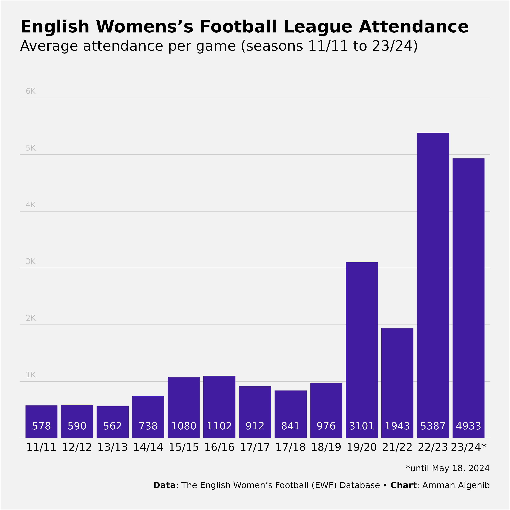
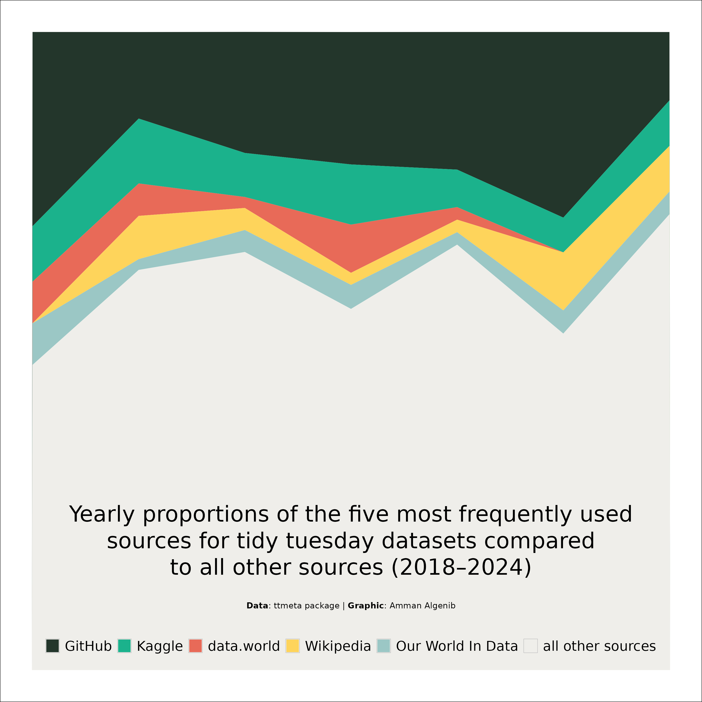
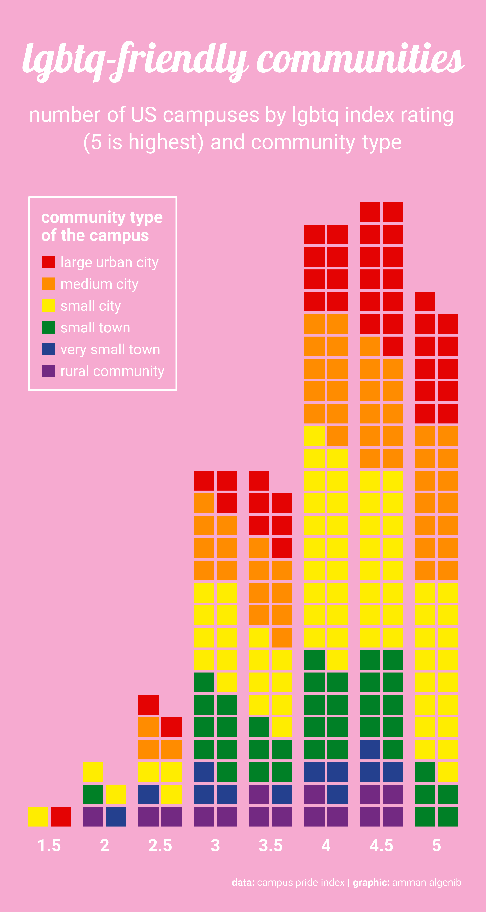
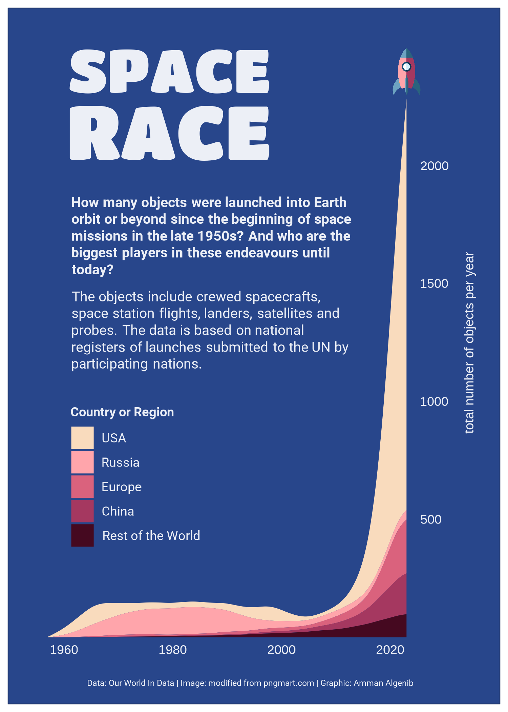

## TidyTuesday 2024

### Week 33 

[(script)](https://github.com/aalgenib/tidytuesday/blob/main/2024/week_33/tt2024w33_gh.R)

### Week 32 

[(script)](https://github.com/aalgenib/tidytuesday/blob/main/2024/week_32/tt2024w32_gh.R)

### Week 31 

[(script)](https://github.com/aalgenib/tidytuesday/blob/main/2024/week_31/tt2024w31_gh.R)

### Week 30 

[(script)](https://github.com/aalgenib/tidytuesday/blob/main/2024/week_30/tt2024w30_gh.R)

### Week 29 

[(script)](https://github.com/aalgenib/tidytuesday/blob/main/2024/week_29/tt2024w29.R)

### Week 27 

[(script)](https://github.com/aalgenib/tidytuesday/blob/main/2024/week_27/tt2024w27_gh.R)

### Week 26 

[(script)](https://github.com/aalgenib/tidytuesday/blob/main/2024/week_26/tt2024w26_gh.R)

### Week 25 

[(script)](https://github.com/aalgenib/tidytuesday/blob/main/2024/week_25/tt2024w25_gh.R)

### Week 24 

[(script)](https://github.com/aalgenib/tidytuesday/blob/main/2024/week_24/tt2024w24_gh.R)

### Week 23 

[(script)](https://github.com/aalgenib/tidytuesday/blob/main/2024/week_23/tt2024w23_gh.R)

### Week 22 

[(script)](https://github.com/aalgenib/tidytuesday/blob/main/2024/week_22/tt2024w22_gh.R)

### Week 21 

[(script)](https://github.com/aalgenib/tidytuesday/blob/main/2024/week_21/tt2024w21_gh.R)

### Week 19 

[(script)](https://github.com/aalgenib/tidytuesday/blob/main/2024/week_19/tt_2024_w19_gh.R)

### Week 18 

[(script)](https://github.com/aalgenib/tidytuesday/blob/main/2024/week_18/tt_2024w18.R)

### Week 17 

[(script)](https://github.com/aalgenib/tidytuesday/blob/main/2024/week_17/tt2024w17.R)
