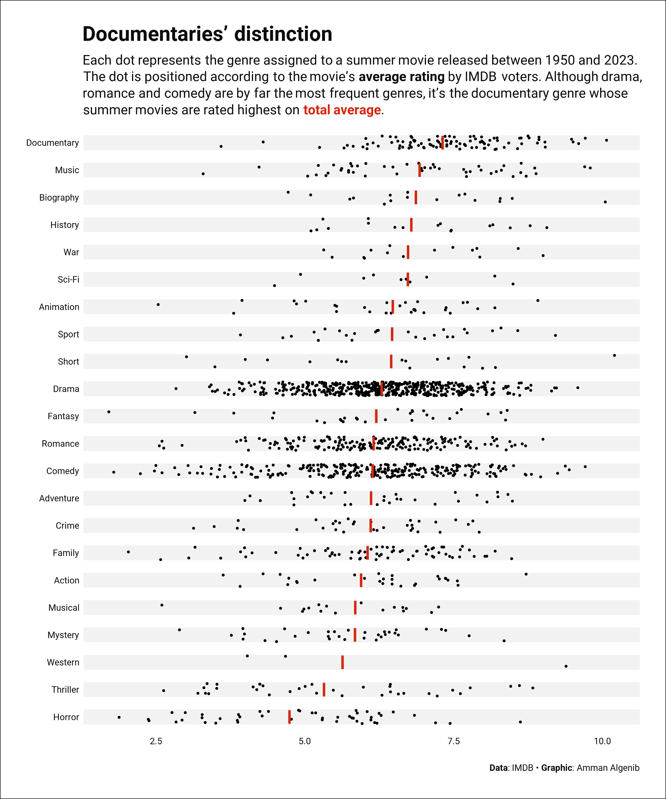

## TidyTuesday 2024

### Week 33 

[(script)](https://github.com/aalgenib/tidytuesday/blob/main/2024/week_33/tt2024w33_gh.R)

### Week 32 

[(script)](https://github.com/aalgenib/tidytuesday/blob/main/2024/week_32/tt2024w32_gh.R)

### Week 31 

[(script)](https://github.com/aalgenib/tidytuesday/blob/main/2024/week_31/tt2024w31_gh.R)

### Week 30 

[(script)](https://github.com/aalgenib/tidytuesday/blob/main/2024/week_30/tt2024w30_gh.R)

### Week 29 

[(script)](https://github.com/aalgenib/tidytuesday/blob/main/2024/week_29/tt2024w29_gh.R)
